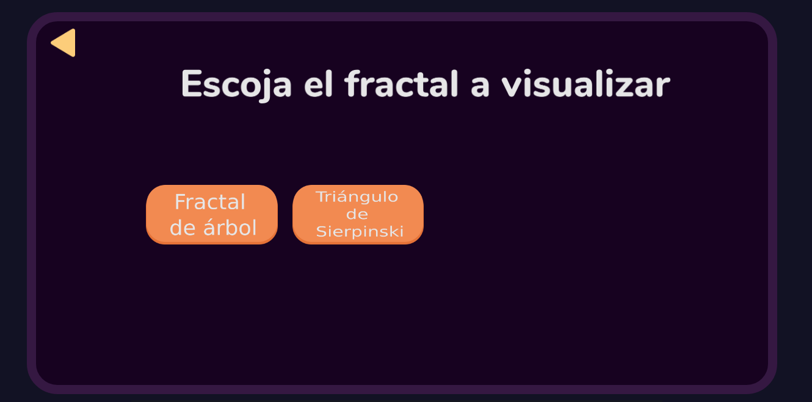
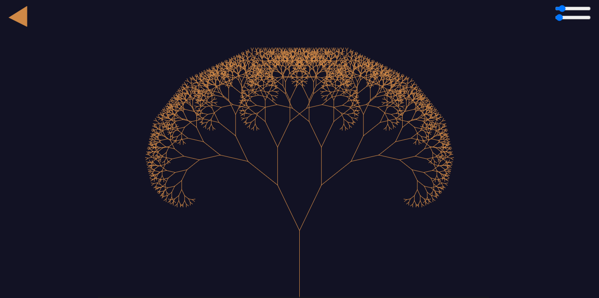
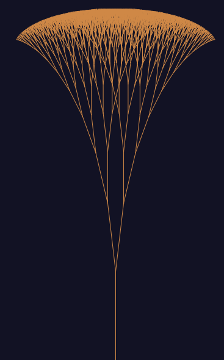
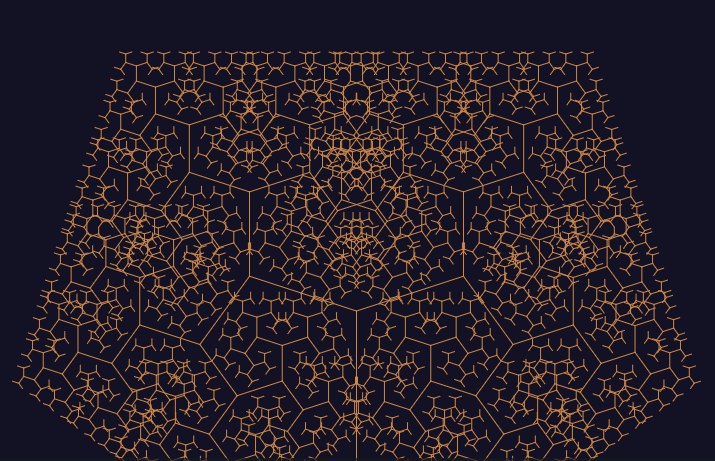
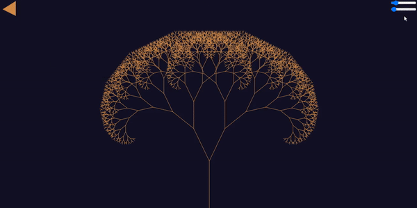

# Vida Articial
Proyecto de vida artificial 2020-2 (Fractales)

Johan Fernando Florez Benávides - 1734417 - 3743

Diego Andrés Bonilla Viáfara - 1722399 - 3743

## Cómo ejecutar:  

Abrir con el navegador el archivo index.html que se encuentra en la misma carpeta que este README

## Página principal:
 

Al presionar en el botón de entrar se mostrará esta interfaz:

 

Aquí podrá escoger que fractal desea visualizar. 

## Fractal de árbol

Al escoger el fractal de árbol se mostrará esta interfaz:

En la esquina superior izquierda se encuentra la flecha de ir atrás para poder escoger otro fractal.

En la esquina superior derecha se encuentran dos sliders con los cuales puede interactuar con el fractal:

* Slider superior: Mover este slider le permitirá cambiar el ángulo de ramificación de las ramas del árbol y de esta forma obtener vistas como esta: 

    

    O como esta:

    

* Slider inferior: Mover este slider le permitirá quitar o agregar ramas al árbol y de esta forma ver su proceso de ramificación

    

