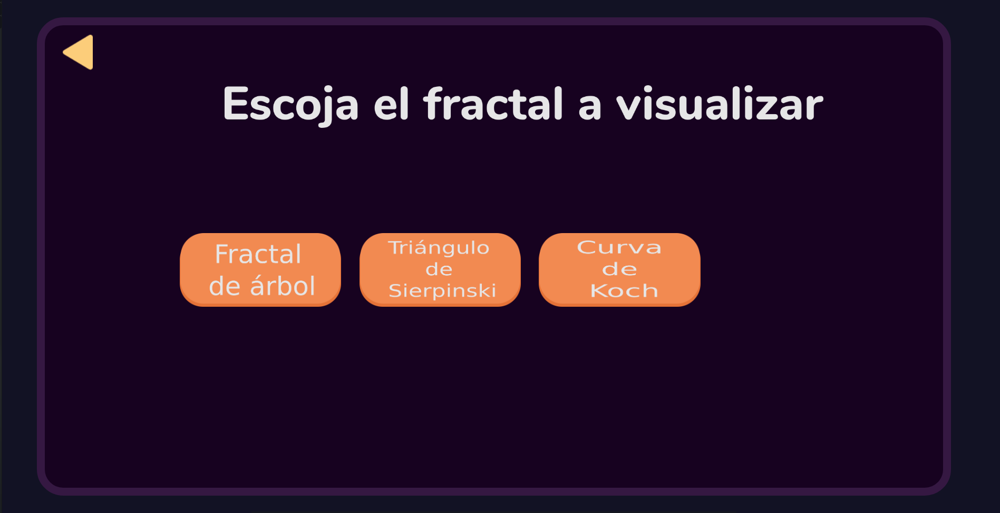

# VidaArticial
Proyecto de vida artificial 2020-2 (Fractales)

Johan Fernando Florez Benávides - 1734417

Diego Andrés Bonilla Viáfara - 1722399

## Cómo ejecutar:  

Abrir con el navegador el archivo index.html que se encuentra en la misma carpeta que este README

## Página principal:
 

Al presionar en el botón de entrar se mostrará esta pantalla:

 

Aquí podrá escoger que fractal desea visualizar

